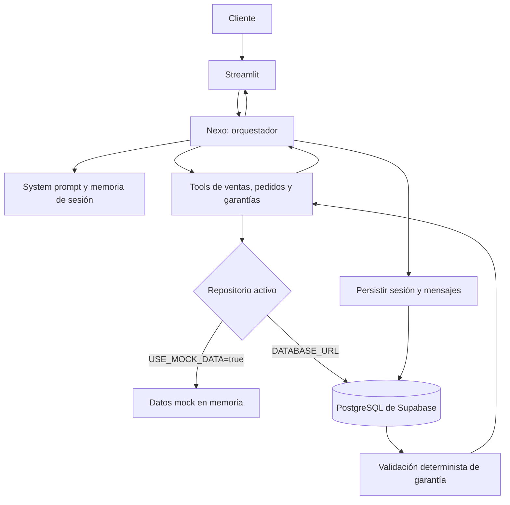

# Retail Agent

Proporcionar con Nexo atención para productos electrónicos mediante catálogo, pedidos, garantías y memoria de sesión. Usar OpenRouter mediante el SDK de OpenAI y PostgreSQL administrado por Supabase para persistencia.

## Requisitos

- Python 3.10 o superior
- uv
- Una clave de OpenRouter
- Un proyecto de Supabase con PostgreSQL habilitado
- La contraseña de la base de datos de Supabase

## Instalación

```bash
uv sync
```

1. Copiar `.env.example` y crear un archivo llamado `.env` en la raíz del proyecto.
2. Abrir `.env` y diligenciar `OPENROUTER_API_KEY` con la clave de OpenRouter.
3. Diligenciar `DATABASE_URL` con la cadena PostgreSQL del proyecto de Supabase.
4. Dejar `USE_MOCK_DATA=false` para usar Supabase.

Usar `MODEL_NAME` de forma opcional. Mantener `.env` como archivo local y no subirlo al repositorio.

Configurar `DATABASE_URL` con la cadena PostgreSQL de Supabase. Para el pooler, usar el usuario, la contraseña de base de datos y el host mostrados en **Connect > ORMs > SQLAlchemy**. Codificar la contraseña para URL si contiene caracteres especiales.

Trabajar sin conexión a Supabase:

```env
USE_MOCK_DATA=true
```

Usar en ese modo los datos de `app/database.py` y no escribir en PostgreSQL.

Omitir `DATABASE_URL` al ejecutar las pruebas locales con `USE_MOCK_DATA=true`.

## Ejecución

```bash
uv run db-init
uv run retail-agent
```

Ejecutar también `uv run streamlit run ui.py` de forma directa.

## Flujo de la solución



Permitir al modelo decidir cuándo usar una tool, pero mantener fuera del modelo la decisión de precios y cobertura. Consultar el repositorio desde las tools y devolver datos verificables.

## Estructura

- `app/client.py`: cliente OpenRouter y configuración.
- `app/schemas.py`: validaciones Pydantic y estado de sesión.
- `app/db/`: conexión PostgreSQL, inicialización y repositorios.
- `app/tooling.py`: funciones ejecutables y esquemas de tools.
- `app/agent/`: prompt, loop de tools y memoria.
- `app/agent/prompts/system_prompt.md`: identidad, idioma y reglas conversacionales.
- `ui.py`: interfaz de chat e inspección de memoria.

Aplicar automáticamente las migraciones SQL y los datos iniciales mediante `uv run db-init`. Incluir las migraciones `001_initial_schema.sql`, `002_seed_data.sql` y `003_conversations_and_evidence.sql`. Calcular las garantías con la fecha de compra y `warranty_months` del producto. Mantener la cobertura fuera de las decisiones del modelo.

Mantener `db-init` idempotente para las migraciones y semillas incluidas. Ejecutarlo antes de levantar la aplicación cuando se use PostgreSQL.

Guardar las conversaciones en `chat_sessions` y `chat_messages`. Mantener el contenido fuera del prompt del modelo.

## Pruebas

```bash
uv run pytest
```

## Elección de herramientas

- **uv**: administrar el entorno, resolver dependencias y ejecutar comandos reproducibles mediante `pyproject.toml` y `uv.lock`.
- **OpenAI SDK + OpenRouter**: enviar mensajes al modelo y manejar tool calling con una interfaz conocida, sin añadir una capa de abstracción innecesaria.
- **SQLAlchemy + psycopg**: consultar PostgreSQL con parámetros seguros y mantener separada la persistencia de las reglas de negocio.
- **Supabase PostgreSQL**: proporcionar la base de datos administrada, las relaciones y la función SQL de validación de cobertura.
- **Streamlit**: ofrecer una interfaz de chat sencilla para probar el agente y observar su memoria durante una sesión.
- **Pydantic**: validar datos de clientes y representar el estado de la conversación con tipos explícitos.
- **pytest**: comprobar tools, memoria y reglas de garantía sin depender de una llamada al modelo.
